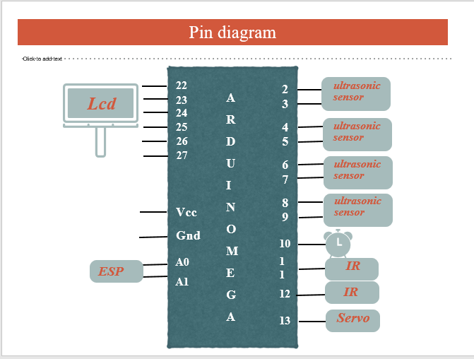
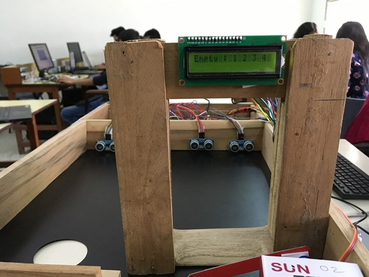
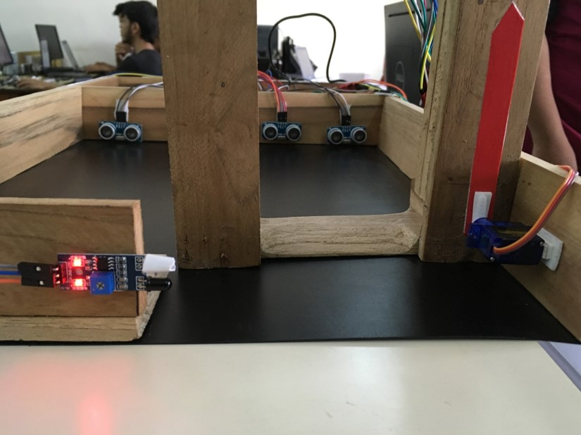
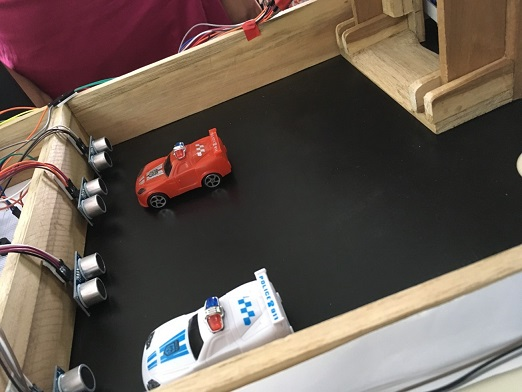

# Smart-Parking-System
Smart Parking System is an IoT based prototype that helps monitoring parking slots.
**Description:** 
1)The Smart Parking System using ThingSpeak provides an efficient way of parking system to the people who frequently visit shopping malls where finding a correct parking slot is difficult. 
2)The Smart Parking System simplifies the tedious job of finding the space before entering into a parking area. 
3)It detects occupancy status of each space in multilevel parking area. 
4)It displays the available spaces at entrance of parking area. 
5)ThingSpeak Cloud to store plot graph of data which is being sent through ESP module to the 
cloud.
6)Line detection system to avoid improper parking. 
7)Opening and Closing of gates when the sensor detects a vehicle.  
**Requirements:**  
**Hardware:** 
Arduino Mega 2560(1),Breadboard, Ultrasonic Sensor ( Adraxx HC-SR04 )to detect presence of car in slot, IR Sensor to detect vehical at gate, Servo motor to open the gate after receiving signal from IR sensor, ESP Module, Jumper wires, USB Cable.  
**Software:** 
Arduino IDE, Thingspeak  
**ScreenShots:** 
1) Pin Diagram:  
  
  
  
  

